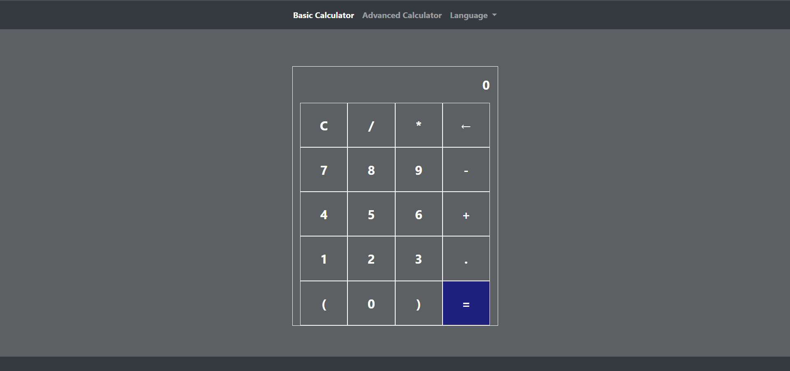

# Funkcionális specifikáció

## 1. Jelenlegi helyzet leírása
* A cég megkért minket és mondták, hogy könnyítsük meg a diákok/hallgatók életét egy számológép megírásával és jelenítsük meg egy weboldalon. Beleértve azt is, hogy a korosztálytól függetlenül is legyen jól használható.
---
## 2. A rendszernek a céljai
* Felhasználó barát (korosztálytol független)
* Működőképes funkciók, műveletek
* A számológépnek bárhonnan és bármikor hozzáférhető legyen az interneten hibamentesen, sebességben megfelelően
* A tanulók/hallgatók az alap, illetve a haladó matematikai műveletekre hozzáférhessenek egy gomb nyomással.
* A weboldal tartalmazzon két gombot, ahol tudnak váltani két számológép között (alap és haladó)
* A weboldal 3 nyelven legyen elérhető (Magyar, Angol, Kínai)
* Könnyen kezelhető legyen kórtól függetlenül
* Alap és haladó matematikai műveleteket tudjon megoldani
---
## 3. Vágyalom rendszer leírása
* A weboldalt HTML, CSS és JavaScriptben fogjuk megvalósítani, legfontosabb, hogy ha implementálunk gombokat, amely lenyomással a számolások, funkciók, számológépek közötti váltások, nyelvi opciók funkcionálása jól működjenek és hibza kezeléssel legyenek kezelve.
---
## 4. Funkcionális követelmények
* Az alábbi funkciókat érhessék el a tanulók/hallgatók az alap számológépnél:
    * Összeadás
    * Kivonás
    * Szorzás
    * Osztás
    * Clear gomb
    * Zárojelek alkalmazása
    * Végeredmény megjeleítése
* Illetve a haladó számológépnél:
    * Gyökvonás
    * Hatványozás
    * Logaritmus
    * Modulus
    * Faktorizálás
---
## 5. Megrendelői követelmény
* Háttérszín legyen barátságos a szemnek
* Felhasználói barát legyen
* Betű típus legyen látható
* Legyen reszponzív dizájn
* A számok legyenek láthatóak benne
* Gombok legyenek láthatóak
* A keretek és a számok legyenek fehér színűek
---
## 6. Jelenlegi üzleti folyamatok modellje
* Sajnálatos módon a mai világban az oktatás nem használja ki megfelelő módon a technológiát arra, hogy a diákoknak/hallgatóknak egy jól funkcionáló számológépet biztosítsanak, ezért sokkal nehezebb nekik megírni az adott feladatot.
Ebben a korszakban is ritkán használnak számológépet interneten keresztül, többsége leginkább papíron számol, amely sok papírpazarláshoz vezet.

---
## 7. Igényelt üzleti folyamatok modellje
* Azért írjuk meg ezt a weboldalt, mert a cég megkért minket és mondták, hogy könnyítsük meg a diákok/hallgatók életét egy számológép megírásával és jelenítsük meg egy weboldalon.
---
## 8. Követelménylista
* [K01] Hordozhatóság
* [K02] Reszponzív dizájn
* [K03] Rendszerfüggetlenség
* [K04] Gyors működés
* [K05] Könnyű kezelhetőség
* [K06] Helyi adatfeldolgozás
* [K07] Pontos számítás
--- 
## 9. Használati esetek
* A program az iskoláktól/egyetemektől függetlenül bárkinek és bárhol hozzáférhető lesz.
--- 
## 10. Képernyő tervek
* A weboldal megnyitásakor egy alap számológép(9 gombos) fogja várni a felhasználókat, amit az alap műveletek elvégzésére tudnak használni
* Ezen kívül két gomb található a weboldal tetején, ahol a tanulók/hallgatók az alap-, haladó számológépek között tudnak váltani
* Lesz még egy lenyíló felület, ahol kitudják választani a nekik megfelelő nyelvet
* Az alábbi minta képen jobban lehet látni:

* A mintán látható számológép még nem végleges, viszont a kép remekül bemutatja az alakalmazás elrendezésének tervét.
---
## 11. Forgatókönyvek
### 11.1 A felhasználó belép a weboldalra
Kiválasztja a kívánt számológépet (alapértelmezett a 9 gombos számológép) és dolgozhat azzal.
### 11.2 A felhasználó beírja a neki szükséges számokat
Gombnyomás segítségével kiválasztja a számokat és azokkal kiszámolja az eredményt.
### 11.3 A felhasználó leolvassa az eredményt
Egyenlőség gomb lenyomásával megkapja az eredményt és tovább halad.

---
## 12. Fogalomszótár
* **Gombok**: működőképes gombnyomás után a számoknak, műveleteknek a megjelenítése
* **Eredmény**: matematikai műveletek végrehajtása után az eredmény jó kiiratása az adott mezőre
* **HTML:**
Másnéven HyperText Markup Language, melyet weboldalak készítéséhez fejlesztettek ki.
* **CSS:**
Másnéven Cascading Style Sheets egy stílusleíró nyelv, mely a HTML vagy XHTML típusú strukturált dokumentumok megjelenését írja le.
* **JavaScript:**
Egy objektumorientált, prototípus-alapú szkriptnyelv, amelyet weboldalakon gyakran használnak.
